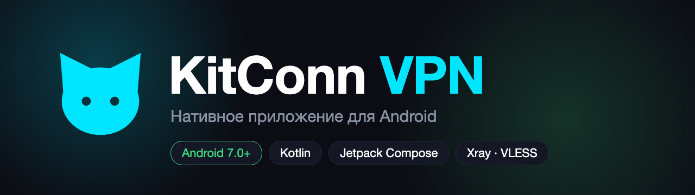
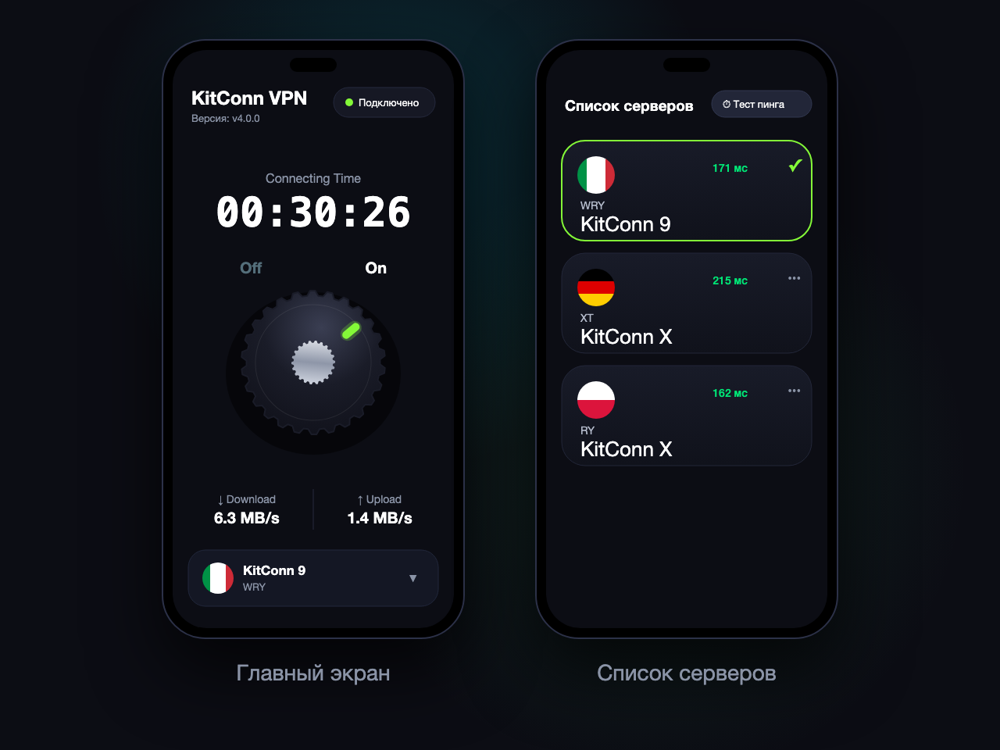

<p align="center">
  
</p>

<p align="center">
  
  
  
  
</p>

## О приложении

**KitConn VPN** — нативный клиент для Android. Подключается к серверам по протоколу **VLESS** через ядро [Xray-core](https://github.com/XTLS/Xray-core)
и пропускает через VPN весь трафик устройства (`VpnService`). Список серверов приложение получает из своего API.

<p align="center">
  
</p>

> Иллюстрация нарисована для README и показывает дизайн приложения, это не скриншот.

## Возможности

- 🎛 **Ручка Off / On**: нажимается и поворачивается, положение следует за реальным состоянием VPN
- ⏱ Таймер подключения, скорость загрузки и отдачи, пинг и объём трафика
- 🌍 Список серверов в виде карточек с круглыми флагами и замером пинга
- 💾 Выбранный сервер запоминается между запусками
- 🔔 Уведомление в шторке с таймером подключения и кнопкой «Отключить»
- 📱 Виджет на рабочий стол: включение и выключение VPN одним касанием
- 🔗 Конфигурации VLESS: TCP, Reality, TLS, **XHTTP**
- 🐱 Минималистичный логотип и сплэш с подмигивающим котом
- 🔄 Экран «Нужно обновление», если сервер просит новую версию

## Как это устроено

```
app/    интерфейс (Jetpack Compose), ViewModel, DI (Koin), сетевой слой (Retrofit), виджет
vpn/    VpnService, запуск Xray, разбор VLESS-ссылок, состояние подключения, уведомление
```

| Слой | Что используется |
|---|---|
| UI | Jetpack Compose, Material 3 |
| DI | Koin |
| Сеть | Retrofit, OkHttp, kotlinx.serialization |
| VPN | `VpnService` + Xray-core (`libv2ray.aar`) |
| Минимальная версия | Android 7.0 (API 24) |

Подключение работает так: приложение разбирает VLESS-ссылку выбранного сервера, собирает конфиг Xray, создаёт TUN-интерфейс
и передаёт его ядру. Само приложение исключено из туннеля, чтобы трафик ядра не зациклился.

## Сборка

Нужны Android Studio и JDK 21.

```bash
./gradlew :app:assembleDebug      # debug-сборка
./gradlew :app:assembleRelease    # release (минификация R8), нужна подпись
```

Токен API в `NetworkModule.kt` в репозиторий не коммитится: поле `API_TOKEN` оставляйте пустым в git и задавайте локально.

## Установка

1. Скачайте APK из раздела [Releases](../../releases) и откройте его на телефоне (разрешите установку из неизвестных источников).
2. При первом подключении подтвердите системный запрос на добавление VPN-конфигурации.
3. На Android 13 и новее разрешите уведомления: без них не будет статуса в шторке.

## Благодарности

- [Xray-core](https://github.com/XTLS/Xray-core) — ядро VLESS / Reality / XHTTP
- Kotlin и Jetpack Compose
